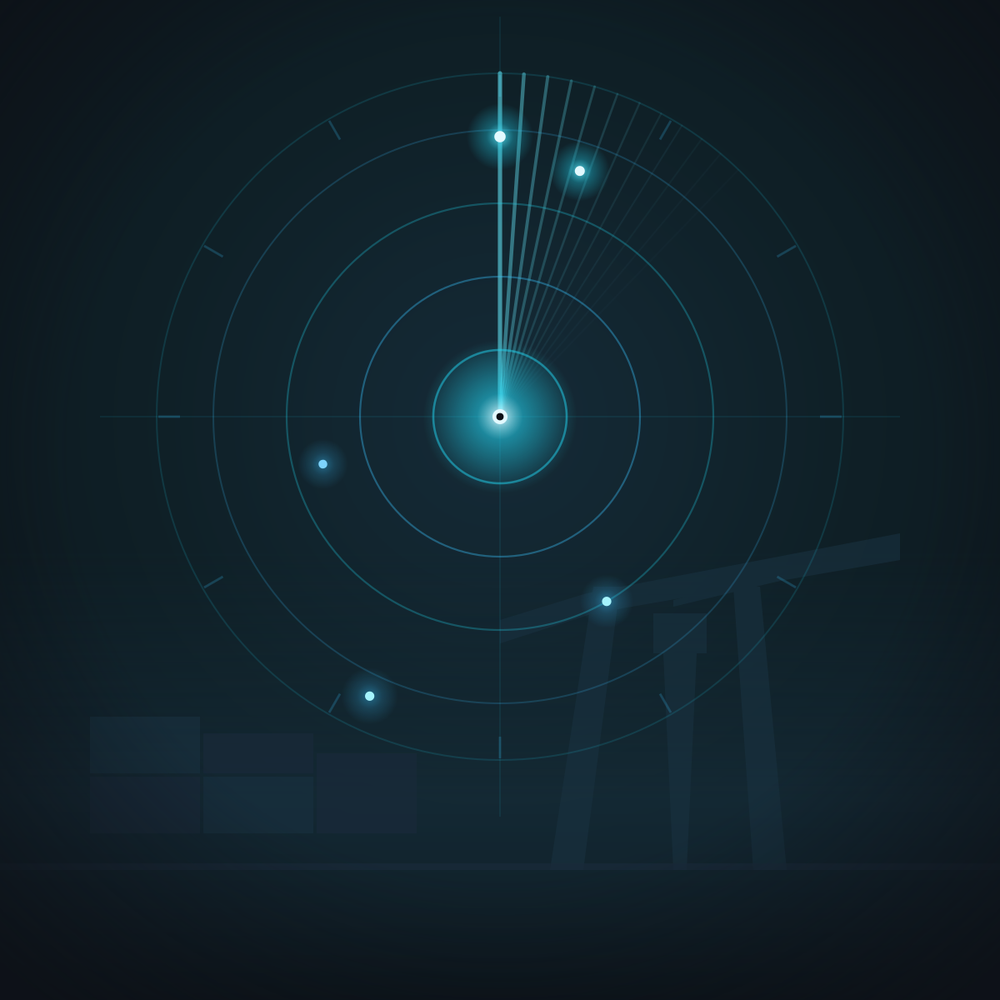

 

 

### Olá, sou o Everteson

Sou desenvolvedor full stack. Trabalho no Porto de Santa Catarina com planejamento e operações, e é de lá que vem boa parte dos problemas que viram sistema: fila de navio, decisão sob prazo curto, dado espalhado em planilha e boletim.

Construo ferramentas para resolver isso de verdade, do back-end ao desktop, e uso inteligência artificial como parte do trabalho, não como vitrine: visão computacional, OCR, embeddings e agentes entram quando resolvem um problema real, não por moda.

Portfólio: https://portifolio.iaever.shop

 

 

 

### Stack

<strong>Back-end</strong>
 

  

<strong>Front-end</strong>
 

  

<strong>Infraestrutura e IA</strong>
 

 

 

### Projetos

<table width="100%">
  <tr>
    <td colspan="2">
      <strong>Concord</strong> 
      Plataforma de comunicação em tempo real: voz, vídeo e compartilhamento de tela nativo, publicando direto no LiveKit sem passar pela barra de aviso do navegador. O projeto grande e atual, ainda sem repositório público.
        
      
      
      
      
    </td>
  </tr>
  <tr>
    <td width="50%">
      <strong>Status das Praticagens</strong> 
      Monitoramento nacional de barras com scraping, OCR de boletim e alertas automáticos por e-mail.
        
      
      
      
    </td>
    <td width="50%">
      <strong>PortoFlow</strong> 
      Monitoramento de chegada de navios: operações portuárias acompanhadas em tempo real.
        
      
      
        
      
    </td>
  </tr>
  <tr>
    <td width="50%">
      <strong>ZETA</strong> 
      IA pessoal com modo agente, geração de código e integrações web.
        
      
      
    </td>
    <td width="50%">
      <strong>OrçaFácil</strong> 
      App desktop de orçamento inteligente, construído com Electron e React.
        
      
      
        
      
    </td>
  </tr>
  <tr>
    <td width="50%">
      <strong>MeuBolso</strong> 
      Controle financeiro pessoal em TypeScript.
        
      
        
      
    </td>
    <td width="50%">
      <strong>Entrevistador</strong> 
      Ferramenta de apoio para condução e preparação de entrevistas.
        
      
        
      
    </td>
  </tr>
  <tr>
    <td width="50%">
      <strong>SaaS para Barbearias</strong> 
      Dashboard, agenda e controle financeiro para barbearias.
        
      
      
    </td>
    <td width="50%">
      <strong>Gerador de Dashboards Automáticos</strong> 
      CSV, Excel ou API vira gráfico e layout de dashboard automaticamente. Em desenvolvimento.
        
      
    </td>
  </tr>
</table>

 

 

### Métricas

&nbsp;&nbsp;

&nbsp;&nbsp;

  

<!-- Esta imagem só aparece depois que a Action em .github/workflows/snake.yml rodar pela primeira vez: ela publica o SVG na branch "output", que ainda não existe até a primeira execução. -->

 

 

### Contato

<!-- TROCAR: URL do LinkedIn -->

<!-- TROCAR: URL do Discord -->

 

